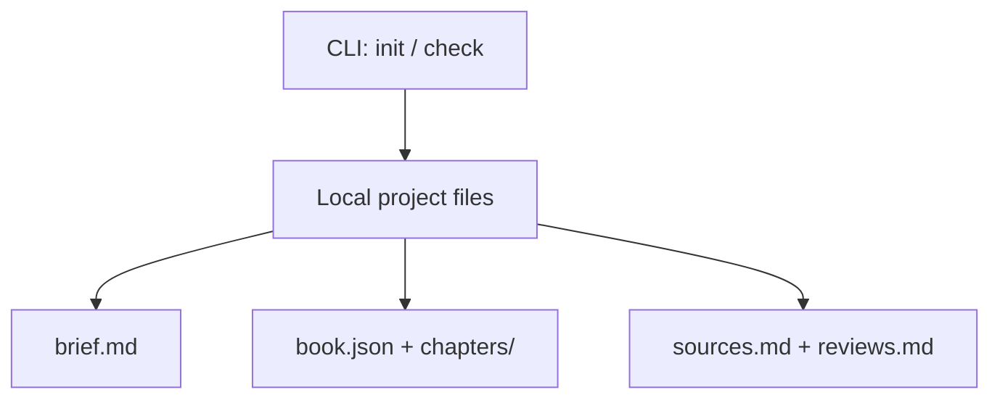

# Architecture overview

## Product boundary

Book Genie should help an author move from a defined book promise to an approved manuscript: brief → outline → chapter plan → evidence → draft → review → revision → export. The author controls content and approvals. This is a proposed direction, not evidence that these steps have already been built.

## Current slice

`book.json` is the machine-readable index of ordered chapters; Markdown is the editable content. `check` confirms structure only, not quality, factual accuracy, citation validity, or approval. The project directory is the portability boundary. The current implementation has no network calls.

## Target components (planned)

| Component | Responsibility | Initial seam |
| --- | --- | --- |
| Intake and book brief | Audience, promise, genre, voice, length, exclusions, manuscript-specific requirements | `brief.md` |
| Outline and planning | Ordered chapters, chapter goals, section plans, dependencies | `book.json` and `chapters/` |
| Evidence and provenance | Source details, claim mapping, quotation permissions, uncertainty | `sources.md`; later structured records |
| Drafting adapter | Generate sections from bounded context and a selected provider | Future provider interface; no provider chosen |
| Consistency and editing | Maintain terminology, narrative arc, chapter coverage, repetition checks | Future manuscript review service |
| Human review | Author comments, revision requests, approvals, version history | `reviews.md`; later workflow state |
| Export | Compile approved chapters for manuscript review and publishing | Future DOCX/PDF/EPUB adapters |

Each generation request should receive the book brief, a bounded chapter plan, relevant approved context, and traceable source references. Store draft outputs separately from approved text; preserve human edits. Factual claims, quotations, and personal histories require attribution and review appropriate to the manuscript. Avoid fabricated citations and unsupported claims.

## Extension path

1. Keep the project schema versioned so future migrations are possible.
2. Add structured chapter goals and sources once an author workflow establishes the required fields.
3. Add provider adapters behind a narrow generation interface, with explicit cost, privacy, and retry behavior.
4. Add web UI and multiuser storage only if real workflows require them; the filesystem format remains importable/exportable.
5. Add genre-specific templates as optional configuration, with the core workflow reusable across nonfiction and memoir.

No vendor, framework, database, hosting platform, licensing model, or publishing channel is fixed here.
